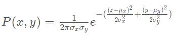

# Kidnapped-Vehicle-Project

This repository contains C++ code for implementation of Particle Filter to localize a vehicle kidnapped in a closed environment. 

## Localization Algorithm

Localization in case of self driving vehicle makes use of GPS, range sensors, landmark information and a global map based on the following algorithm given below:

1. A global map of different areas is constructed, in which the self driving vehicle is to be deployed. This map contains information about different location of 'landmarks'. Landmarks are nothing but major features present in the locality, which are not subject to change for a longer period of time. Examples can be buildings, signal posts, intersections, etc. These landmarks are used in later steps to predict the relative location of car. These maps are updated often so as to add new features and refresh the locations of existing features.
2. Once a map is constructed, GPS sensor installed inside the vehicle is used to predict the locality in which it is present. On basis of this locality, only a portion of global map is selected to avoid a large number of real time calculations as the algorithms must run in real time. As stated earlier, GPS sensor provides noisy measurement and hence cannot be used alone for localization.
3. LIDAR and/or RADAR sensor installed on the vehicle then measure the distance between it and the landmarks around it. This helps in further pinning down location of the vehicle as it is now relative to landmarks in the global map constructed earlier. However, LIDAR and RADAR information is also not accurate and prone to noise. Hence, a sophisticated technique like Particle Filter is used.
4. Particle Filter is used to combine the information gained from all above steps and predict the location of car with high accuracy of 3-10 cm.

The whole algorithm repeats at run time when the car is moving and new location of car is predicted.

## Project Implementation

Each major step involved in implementation is illustrated below:


The C++ program for localization was implemented using following major steps:

1. A noisy measurement from GPS sensor was received and used to initialize the position of vehicle. This measurement included the x coordinate, y coordinate (both in m) and the theta (orientation) of vehicle in radian. Noise is modeled by Gaussian distribution with standard deviation in x, y and theta provided as a part of GPS uncertainty specification.
   Particle filter algorithm uses particles to represent the location of vehicle. Hence, in this case, 20 particles were created and initialized to locations taken from normal distribution with mean equal to the location received from GPS and standard deviation equal to the GPS measurement uncertainty. The number of particles was a tunable parameter and was chosen after multiple iterations described in later steps of implementation.
2. Global map of environment is initialized. This map is represented by a list x and y coordinates of landmarks in the environment.
3. Once map and particles are initialized, the vehicle implements **Prediction** step in which the location of each particle at next time step is predicted. This is done by using information of control inputs and time elapsed between time steps. The control inputs are nothing but magnitude of velocity (v) and yaw rate (θ). Location update is done with the help of formula given below:


4. After prediction step, the vehicle implements **Update** step. In this step, particles are assigned with weights corresponding to their prediction. The process is stated below:

   a. The vehicle uses LIDAR to sense its distance from landmarks and predict the location of landmarks as observed. This is received as a list of x, y coordinates along with the noise mapped as standard deviation in X (σx) and Y (σy) axes. Since, the LIDAR sensor is installed on the robot, these observations are received in x, y coordinate axes relative to the direction of motion of vehicle. This is shown below:


   Here, X axis is in the direction of motion of the vehicle and Y axis is perpendicular to X axis to the left.


   The landmarks are shown with annotations L1-L5. Observations recorded in vehicle's coordinates are annotated OBS1-OBS3. The ground truth of vehicle is shown in red while the prediction of location vehicle as derived by the particle is shown in blue.

   b. To map the observations into global coordinate system, a transformation is done involving translation and rotation but no scaling. This is done by using Homogeneous Coordinate Transformation given by the formula below:


  where xm, ym represent the transformed observation, xc, yc represent the observations in vehicle's coordinate system and xp, yp the location of particle in global map coordinate system.

   c. All landmarks cannot be in the range of vehicle at a given point of time. This is determined by the range of LIDAR sensor. Hence, given the observations at a time, all probable landmarks in the range of a particle are determined. This step involves filtering of landmarks to retain only those which are in the range of the particle.
    

   d. After landmarks are filtered, each observation is then mapped to a landmark using nearest neighbor algorithm. The nearest neighbor algorithm is implemented by calculating Euclidean distance between an observation and all landmarks. The landmark with lowest Euclidean distance is associated to the observation. Hence, multiple observations may be associated to a single landmark.
    

   e. Once every observation is associated to a landmark, weight of the particle is calculated by using Multivariate Gaussian distribution. Since all observations are independent, the total weight of the particle is the product of probabilities calculated by Multivariate Gaussian formula for all observations associated to landmarks. Formula for calculation of individual probabilities is given below:


   

where x and y is the observation and µx and µy are the coordinates of associated landmark. The final weight of particle is product of all probabilities.

  f. The weight of particle is the measure of how close the particle is with respect to to the ground truth of vehicle. The higher the weight, the more accurate is the particle's prediction. Hence, at the end of each update step, 're-sampling' of particles with replacement is done to remove highly improbable particles.

 The update step is (a-f) is run for every particle and weight of each particle is calculated.

6. After update, re-sampling of particles is done. Re-sampling involves retaining of particles with higher weight and crushing of particles with lower weight. Once re-sampling is done, the particle with highest weight is chosen. This particle gives most accurate prediction of vehicle's location.
7. The location provided by particle with highest weight is then compared with the ground truth and error in the system is calculated.
8. Once initialization, prediction, update and re-sampling is implemented, the program is run under testing and error in the system along with run time is noted. To get the best estimate of vehicle's position in real time, the number of particles is tuned and finalized.

### Running the project in Ubuntu

This will install gcc, g++, cmake, make and uWebsocketIO API.

```bash
$ ./install-ubuntu.sh
$ ./build.sh
```

`NOTE: Run the Udacity simulator and check the results`